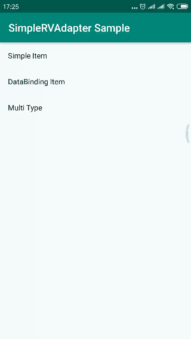
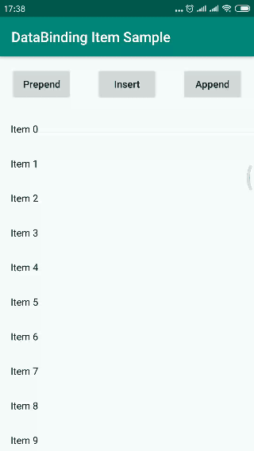
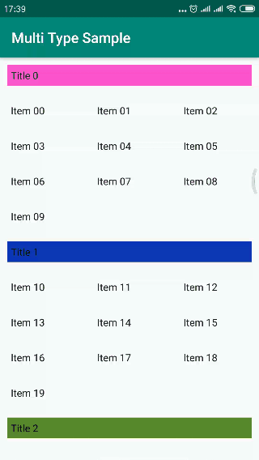
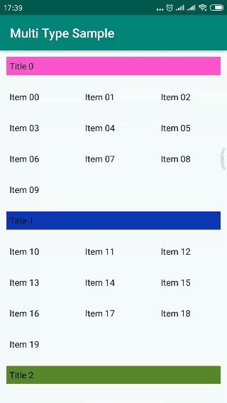

# 最新版本

模块|adapter-base|adapter-core|adapter-binding
---|---|---|---
最新版本  |   [](https://bintray.com/nstd/maven/adapter-base/_latestVersion)  |  [](https://bintray.com/nstd/maven/adapter-core/_latestVersion)  |  [](https://bintray.com/nstd/maven/adapter-binding/_latestVersion)


# 目录

- [介绍](#介绍)
- [样例图](#样例图)
- [配置](#配置)
- [基本用法](#基本用法)
- [基本用法](#基本用法)
  - [单类型](#单类型)
  - [多类型](#多类型)
- [友情提示](#友情提示)
- [更新日志](#更新日志)
- [待完善](#待完善)
  
---

## 介绍
`RecyclerView`可能是我们在日常工作中最常用的一个控件，而在实现`Adapter`和`Holder`的时候，往往需要写很多模板方法。本项目旨在减少这部分代码。

## 样例图
Simple Item | DataBinding Item | Multi Type
-------------------- | -------------------- | --------------------
 |  | 


## 配置

- 核心库

``` gradle 
dependencies {
    implementation 'com.nstd.rvadpater:adapter-core:1.0'
}
```

- DataBinding支持库

如果想要holder支持DataBinding，请添加以下依赖

``` gradle 
dependencies {
    implementation 'com.nstd.rvadpater:adapter-binding:1.0'
}
```

## 基本用法

### 单类型
如果是单类型的数据，使用SimpleRVAdapter的时候，将会非常简单。

1. 继承`SimpleRVHolder`
``` java
@SimpleHolderLayout(R.layout.text_holder_view)
public class MainItemHolder extends SimpleRVHolder<TextItem> {

    TextView mTextView;

    public MainItemHolder(@NonNull View view) {
        super(view);

        mTextView = findViewById(R.id.tv_text);
    }

    @Override
    public void bindData(Context ctx) {
        mTextView.setText(mItemData.getTextItem());
    }
}
```

在`bindData()`方法中，实现Holder的对于数据的绑定逻辑。

不过这里最麻烦的可能就是view的绑定了，要写一堆`findViewById()`。可以通过ButterKnife进行绑定，或者使用kotlin，当然还可以用DataBinding，本项目还有个实现了DataBinding的Holder `SimpleRVBindingHolder`

以下是继承`SimpleRVBindingHolder`的写法:

``` java
@SimpleHolderLayout(R.layout.text_holder_view)
public class MainItemHolder extends SimpleRVBindingHolder<TextHolderViewBinding, TextItem> {

    public MainItemHolder(TextHolderViewBinding binding) {
        super(binding);
    }

    @Override
    public void bindData(Context ctx) {
        mItemBinding.tvText.setText(mItemData.getTextItem());
    }
}
```

2. 使用SimpleRVAdapter

``` java
SimpleRVAdapter adapter = new SimpleRVAdapter().setFactory(new SimpleRVHolderFactory(MainItemHolder.class));
//...
recyclerView.setAdapter(adapter);
```

3. 设置数据源

``` java
mAdapter.setData(data);
```

### 多类型

多类型的使用，只比单类型的复杂一点点，需要指定不同viewType的类型。
假设我们现在有两种类型，参看[MultiTypeActivity](blob/master/app/src/main/java/com/nstd/rvsample/MultiTypeActivity.java)：



1. 标题Holder (TitleHolder)

``` java
@SimpleHolderLayout(value = R.layout.text_holder_view, viewType = MultiTypeActivity.Item.TYPE_TITLE)
public class TitleHolder extends SimpleRVBindingHolder<TextHolderViewBinding, MultiTypeActivity.Item> {

    public TitleHolder(TextHolderViewBinding binding) {
        super(binding);
    }

    @Override
    public void bindData(Context ctx) {
        mItemBinding.tvText.setText(mItemData.value);
        mItemBinding.tvText.setBackgroundColor(mItemData.color);
    }
}
```

可以在`@SimpleHolderLayout`中直接设置`viewType`，这种设置方式，优先级是最低的

2. 内容Holder (MultiItemHolder)

``` java
@SimpleHolderLayout(value = R.layout.text_holder_view)
public class MultiItemHolder extends SimpleRVBindingHolder<TextHolderViewBinding, MultiTypeActivity.Item> {

    public MultiItemHolder(TextHolderViewBinding binding) {
        super(binding);
    }

    @Override
    public void bindData(Context ctx) {
        mItemBinding.tvText.setText(mItemData.value);
    }
}
```

3. 设置HolderFactory

```java
new SimpleRVHolderFactory()
    .addViewTypeInfo(TitleHolder.class) //因为在SimpleHolderLayout中已经设置了viewType，所以这里不用再额外设置
    .addViewTypeInfo(Item.TYPE_ITEM, MultiItem1Holder.class)
    .setViewTypeGetter((SimpleRVHolderFactory.ViewTypeClassifier<Item>) (data, position) -> data.type);
```

如果通过`addViewTypeInfo()`设置`viewType`，这个方式优先级是最高的，会覆盖`@SimpleHolderLayout`中的`viewType`。

为了通过数据源的type找到对应的Holder type，我们要在Factory中设置一个`ViewTypeClassifier`，不过这一步仍然可以被简化，只要在数据源实现`ViewTypeListener`这个接口即可，当然Factory中设置的`ViewTypeClassifier`优先级要比`ViewTypeListener`高。

### 点击事件

点击事件：`OnItemClickListener`

长按事件：`OnItemLongClickListener`

``` java 
SimpleRVAdapter mAdapter = new SimpleRVAdapter()
                .setFactory(getFactory())
                .setOnItemClickListener(new OnItemClickListener() {
                    @Override
                    public void onClick(View view, int position) {
                        //处理 item 的单击事件
                    }
                })
                .setOnItemLongClickListener(new OnItemLongClickListener() {
                    @Override
                    public void onLongClick(View view, int position) {
                        //处理 item 的长按事件
                    }
                });
```

如果某些特殊的item不需要单击/长按事件，可以在holder的`bindData()`中调用`removeItemClickListener()`/`removeItemLongClickListener()`
参见[SimpleItemActivity](blob/master/app/src/main/java/com/nstd/rvsample/SimpleItemActivity.java)中的[SimpleTextHolder](blob/master/app/src/main/java/com/nstd/rvsample/holders/SimpleTextHolder.java)

## 友情提示

为了便于Holder的组织，本项目生成Holder的时候，使用的是反射，如果对性能有极高要求，请使用其他库。

## 更新日志

### 最近更新

#### v1.0 2019-08-27

第一版发布


### [详细日志](CHANGELOG.md)


## 待完善

- [ ] group分组
